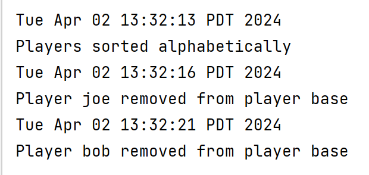

# My Personal Project: Snake

**Functionality**

The application will be a version of the classic game snake. The rules are as follows:

- The game starts with the snake as just one block
- There is one piece of 'food' on the board
- Moving the snake to the square with the food will eat it, and grow the snake by 1
- The goal is to grow your snake until there are no empty squares left

**Users**

Anybody can play snake. Once they understand the rules anyone can play the game for pure enjoyment.

I chose to pursue this project because I used to play snake a lot when I 
was younger. I was never good enough to beat the game, especially since I 
was just a child. In terms of programming, I think this could be a very fun 
project to work on technically and visually. I've always found games interesting
because I could never comprehend how someone could program games that seem
so complex, so I'm hoping to be able to make a working version of this classic
game and also make some customizations to make it more interesting.

**User stories**

**Phase 1**
- As a user, I want to be able to create a new player profile and add it to a list of all players
- As a user, I want to be able to see a list of my high scores
- As a user, I want to be able to pause the game so I can take a break and come back later
- As a user, I want to customize my snake's colour scheme
- As a user, I want to choose the size of the board tiles

**Phase 2**
- As a user, I want to have the choice to save my game so I can play again another time
- As a user, I want to have the choice to load a saved game or start a new one

**Citations**
- JsonSerializationDemo
- SmartHome
- StackOverflow
- Oracle documentation
- Oracle Swing tutorials
- YouTube: KennyYipCoding

**Instructions for grader**
- Run main
- Pressing 'player list' will bring you to the tab of players (X) in the playerbase (Y). This can also
- be done by clicking on the 'players' tab on the left.
- In the players tab, you can sort the players alphabetically by clicking the sort button.
- You can also remove players. You click 'remove' next to the player, and then click save. Clicking refresh will
- show the newe playerbase with the player removed. The player only gets removed if you click save.
- Pressing start from the home screen will lead you to the game setup. If you were on the players tab, click the
- 'game' tab to return to the starting screen.
- Press start
- Type in your desired username. You can check the player list to see if your name is in use.
**New player instructions**
- If you are a new player, click 'New Player' once you've typed your name.
- If you are a new player, you will obviously only be able to start a new game.
- Once you click 'New Game,' enter the desired tile size and snake color. Note: a bigger tile size means bigger tiles
- and a smaller game board. Note: make sure to enter a java recognized color. Some colors like 'purple' are not
- actually Color objects
- Press 'Go!' once you've filled out the fields. Press 'Start game' to start the game.
**Returning player instructions**
- If you are already in the player base, type your name and click 'Returning Player'.
- You have the choice to load a saved game or start or a new one.
- To start a new one, follow the steps mentioned above.
- To load a saved game, press 'Load Game'. Your game data will be displayed brielfy at the bottom of the screen.
- Press 'Start game' in the top right. Be careful, your game starts right away.
**Game saving**
- At any point during the game, you can click 'Save' at the top of the screen to save your current game data.
- Pausing the game first and then saving is recommended.
- At any time, click 'Pause' to pause and unpause the game.
- Once your game is saved, you may close the game and your game data will be saved. You may also continue playing,
- but note that if you lose your saved game will reset.
- If you continue to play after saving, you can pause at any time and close the window. Your old saved game will
- still be there.
- Note: at any point, if you lose the game, the game will end and your save file will be reset to a default game.

**Phase 4: Task 2**
